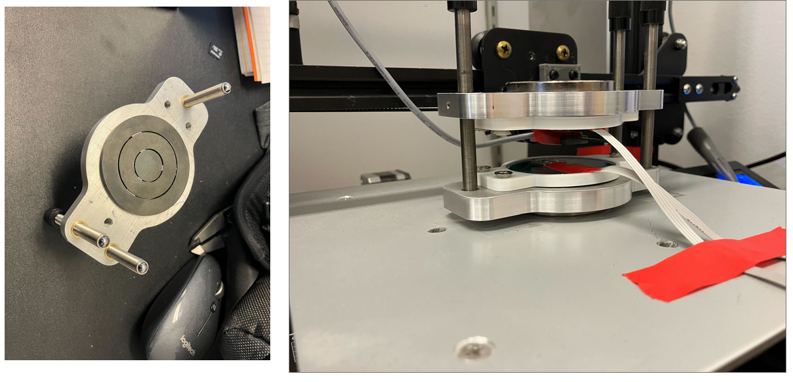
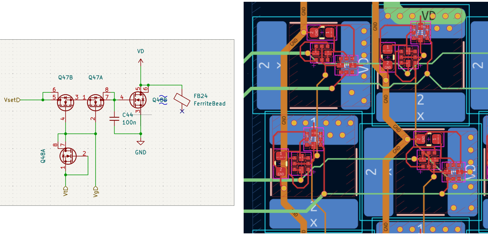
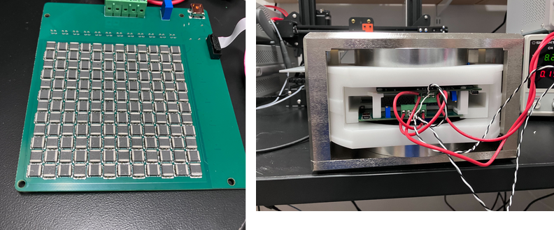
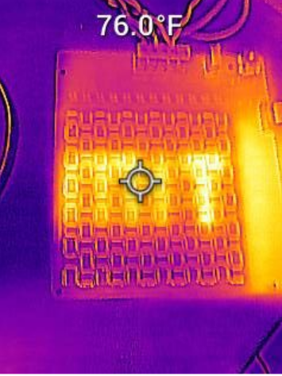
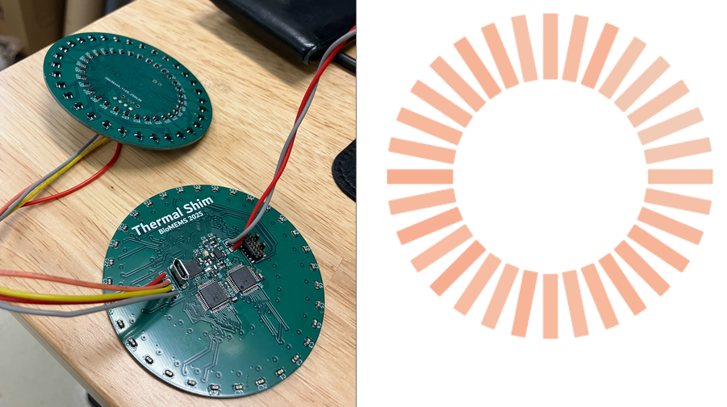
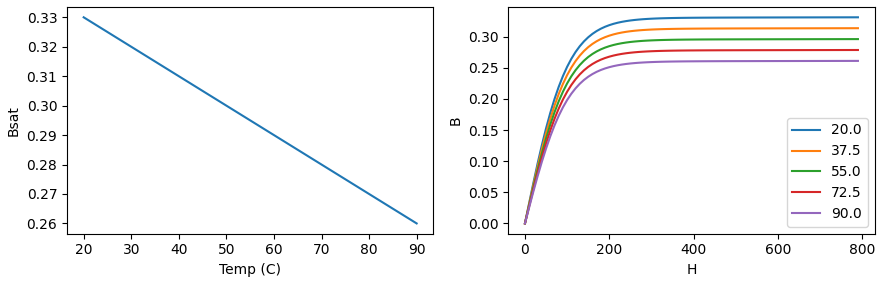

# Thermal Shims

## Shim Demos

### Concentric Rings

This demonstration uses a 4mm ferrite plate cut to size on a waterjet. Each ring is connected to a PCB heater that is counterwound to prevent the development of magnetic fields from the heater current.

### 12x12 Array

This board demonstrates independent closed-loop control over the temperature of 144 ferrite elements. Each ferrite element has a temperature control unit cell attached on the backside of the PCB. This circuit uses two dual-MOSFETs to provide DRAM-like array access to the power setting and temperature readout for that element:

These unit cells can then be connected to form a larger array of N elements, with only sqrt(N) control circuits/ADCs required:

The `12x12 Array` folder contains simulations of the control circuits showing the sequencing required to measure the temperature or set the cell power level. All of this circuitry is included on the PCB for the 12x12 array demo.

### Hub & Spoke NdFeB Magnet Shimming

This board provides temperature control and sensing for 32 NdFeB magnets in a hub & spoke magnet array. This can be used to prevent temperature drift between the magnets during a scan, or even to account for variations in the magnetization of the individual elements. 

## Simulations
The jupyter notebook in the Simulations folder includes code for simulating different arrangements of thermal shims with different temperatures using [FEMM](https://www.femm.info/). These simulations assume an arctangent B/H curve that is parameterized by a linear relationship between the saturation magnetization and the temperature:

To run a simulation with a certain material and temperature, the code creates a custom material based on the calculated BH curve in FEMM. To sweep the temperature, the same simulation is run with different materials.
